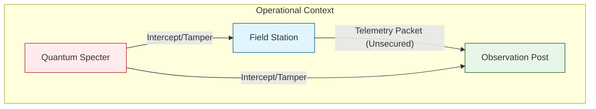
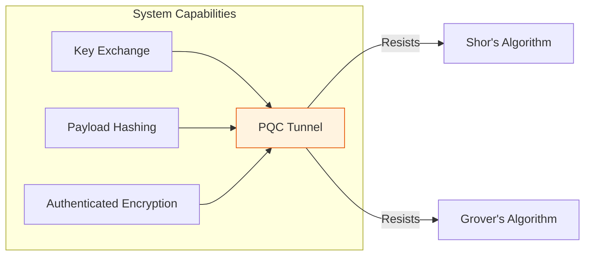
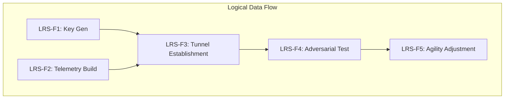
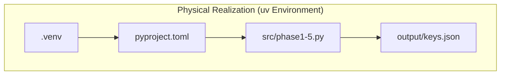

# Architecture Description: Project Icarus
## Quantum-Safe Gravitational Variance Telemetry System

> **Standard Compliance:** ISO/IEC/IEEE 42010:2011 (Architecture Description)  
> **Lifecycle Framework:** ISO/IEC/IEEE 15288:2015 (Systems Engineering)  
> **Methodology:** Arcadia (Architecture Analysis & Design Integrated Approach)  
> **Assessment Model:** ISO/IEC 33001:2015 (Process Assessment)

---

## 1. Executive Summary (Business Context)
**Strategic Objective:** Mitigate the "Harvest Now, Decrypt Later" (HNDL) risk for high-sensitivity gravitational variance telemetry. Project Icarus implements a Post-Quantum Cryptography (PQC) framework ensuring that long-lifecycle data remains secure against future Cryptographically Relevant Quantum Computers (CRQC).

**Business Value Drivers:**
- **Risk Mitigation:** Proactive defense against the collapse of RSA/ECC standards (NIST PQC Migration).
- **Compliance Baseline:** Alignment with NSA CNSA 2.0 and FIPS 203 (ML-KEM).
- **Technological Leadership:** Implementation of Lattice-Based Cryptography as a competitive differentiator in secure instrumentation.

---

## 2. Architectural Framework (ISO 42010)

### 2.1 Stakeholders and Concerns
| Stakeholder | Primary Concerns |
| :--- | :--- |
| **Chief Risk Officer (CRO)** | Long-term data exposure (HNDL), Regulatory compliance. |
| **Lead Research Scientist** | Data integrity of metric perturbation tensors (δgμν). |
| **Security Architect** | SVP hardness, implementation of Lattice-Based schemes. |
| **DevSecOps Engineer** | Deployment automation (uv), dependency management. |

### 2.2 System Environmental Context
The system operates in a high-instability environment where quantum decoherence affects both the adversary (Quantum Specter) and the theoretical negative-mass generator field station.

---

## 3. Arcadia Architecture Analysis

### 3.1 Operational Analysis (Needs & Actors)
The operational goal is to transmit top-secret gravitational data from remote field stations to central observation posts across insecure quantum-contested networks.

**Actors:**
- **Field Station:** Generates telemetry (Metric Tensors).
- **Observation Post:** Consumes and analyzes data via PQC secure tunnels.
- **Quantum Specter (Adversary):** Passive/Active MITM with CRQC capabilities.



### 3.2 System Need Analysis (Requirements)
- **Technical Requirement [TR-01]:** Establishment of an ML-KEM-768 based asymmetric key pair.
- **Technical Requirement [TR-02]:** Secure telemetry payload containing localized reduction of G parameters.
- **Technical Requirement [TR-03]:** Resistance to 10,000-qubit quantum MITM attacks.



### 3.3 Logical Architecture (Functions & Components)
The system is partitioned into five functional phases:
1. **LRS-F1: Key Generation Manager** (Shortest Vector Problem (SVP) based).
2. **LRS-F2: Telemetry Synthesis** (Physics Data Tensor encoding).
3. **LRS-F3: Hybrid Tunneling** (ML-KEM + AES-256-GCM + HKDF).
4. **LRS-F4: Adversarial Simulation** (Lattice Attack Vectoring).
5. **LRS-F5: Agility Controller** (Decoherence-aware algorithm switching).



### 3.4 Physical Architecture (Implementation)
Implemented as a `uv`-managed Python environment for high-performance dependency resolution and reproducible systems engineering.

```
src/
├── src/phase1_key_generation.py      # LRS-F1 implementation
├── src/phase2_telemetry_payload.py   # LRS-F2 implementation
├── src/phase3_secure_tunnel.py       # LRS-F3 implementation
├── src/phase4_quantum_mitm_attack.py # LRS-F4 implementation
└── src/phase5_decoherence_simulation.py # LRS-F5 implementation
```



---

## 4. Lifecycle Process (ISO 15288 Integration)

Project Icarus follows the **Technical Processes** of ISO 15288:
1. **System Analysis Process:** Identification of quantum threat vectors.
2. **Architecture Definition Process:** Using Arcadia to model functional blocks.
3. **Integration Process:** Combining PQC primitives with physics telemetry.
4. **Verification Process:** Simulation of MITM attacks to validate security controls.

---

## 5. Maturity & Capability Assessment (ISO 330xx)

The following table defines the current process capability levels for the PQC Implementation:

| Process ID | Process Name | Maturity Level | Achievement |
| :--- | :--- | :--- | :--- |
| **PQC-01** | Key Management | Level 3 (Defined) | NIST FIPS 203 implementation. |
| **PQC-02** | Payload Integrity | Level 2 (Managed) | SHA-3 Hash verification implemented. |
| **PQC-03** | Threat Defense | Level 2 (Managed) | MITM Simulation validated. |
| **PQC-04** | Crypto-Agility | Level 1 (Performed) | Automated fallback logic active. |

---

## 6. Deployment & Execution (Technical Brief)

### Prerequisites (uv Management)
This project uses `uv` for high-performance virtual environment management and dependency locking.

```bash
# Environment Synchronization
uv sync

# System Execution (Orchestrator)
uv run icarus
```

### Core Cryptographic Primitives
- **KEM:** ML-KEM-768 (Module-LWE based).
- **AEAD:** AES-256-GCM (Authenticated Encryption).
- **KDF:** HKDF-SHA3-256 (Key Derivation).
- **Integrity:** SHA3-256.

---

## 7. Educational Context for Cybersecurity Professionals
This lab serves as a Proof-of-Concept for **Algorithm Agility**. As systems transition from classical to post-quantum standards, the ability to maintain **Perfect Forward Secrecy (PFS)** while navigating the **Quantum Coherence** limits of attackers is paramount for modern infrastructure protection.

---
*© 2026 Icarus Division - Research & Development. Standards-compliant documentation.*
